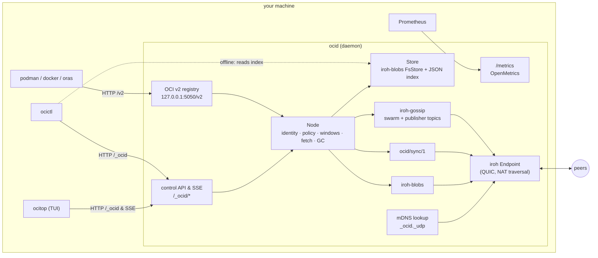
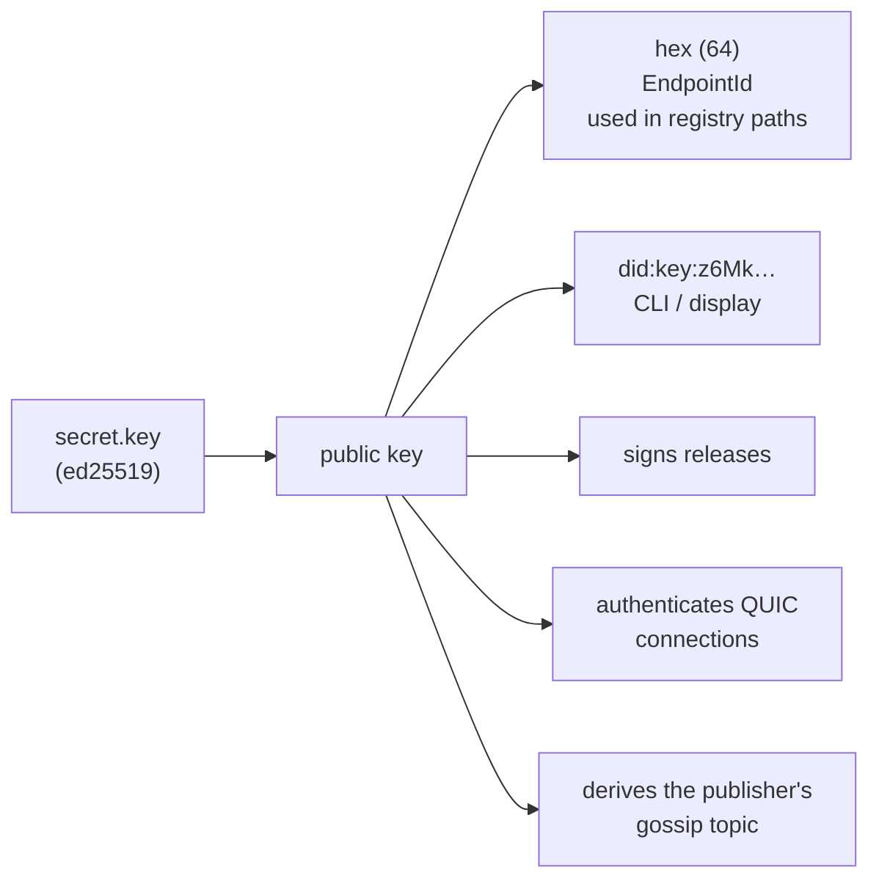
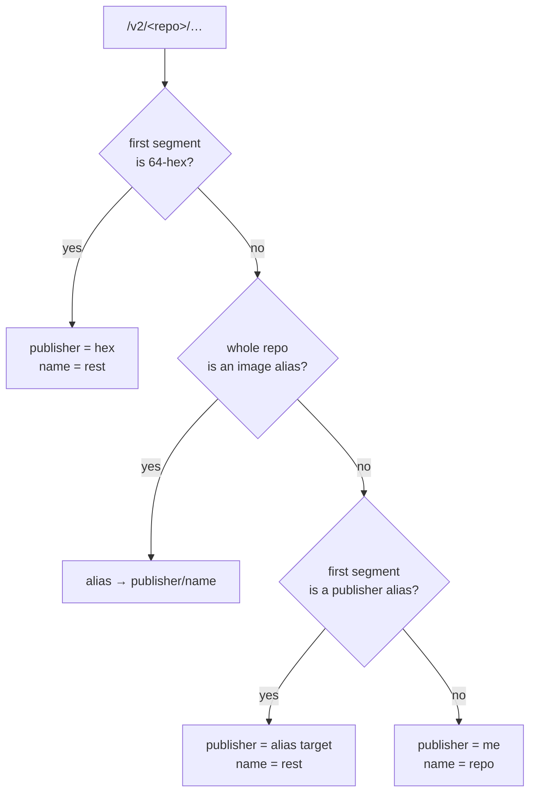
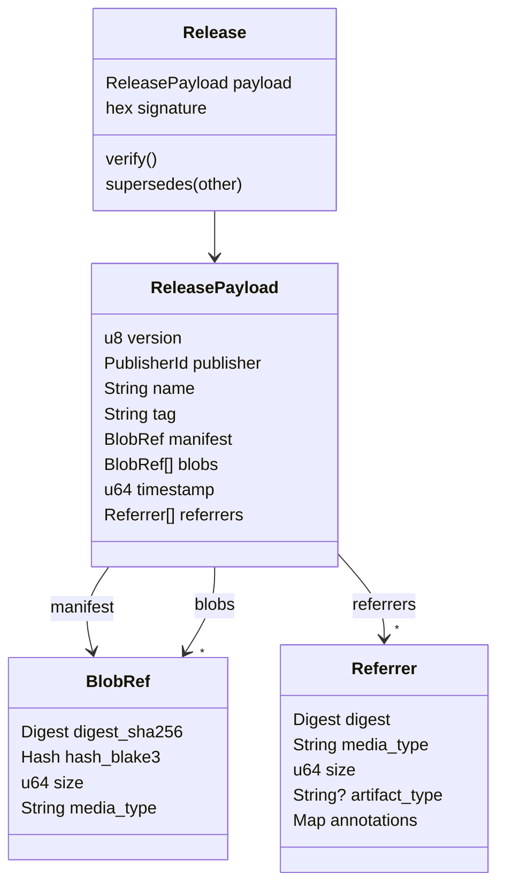
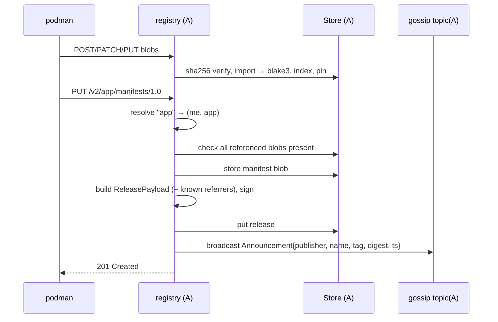
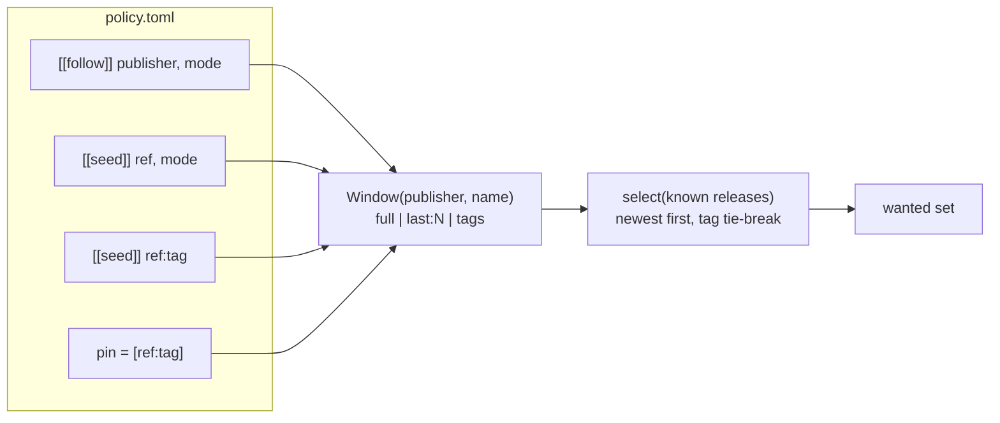
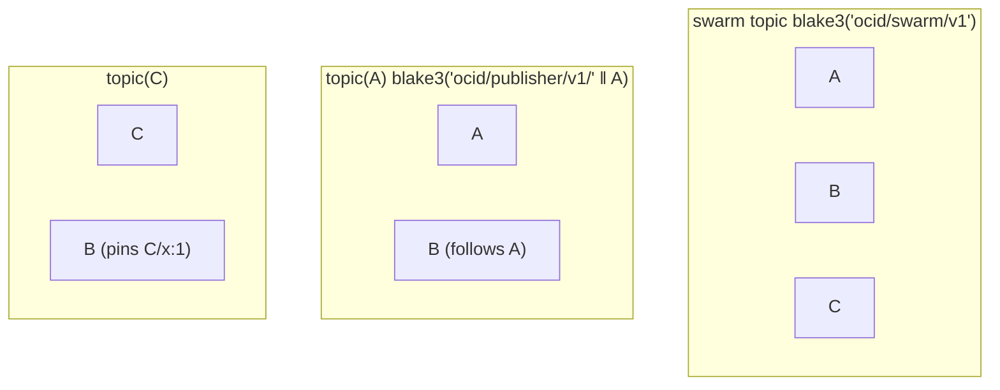
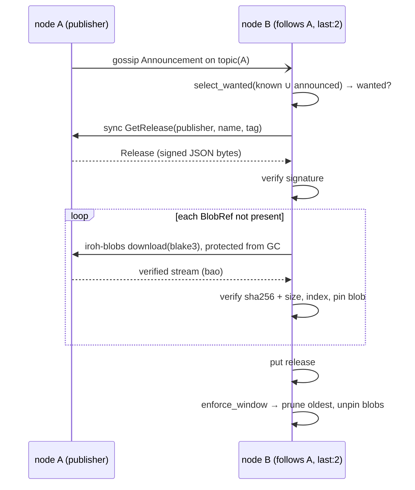
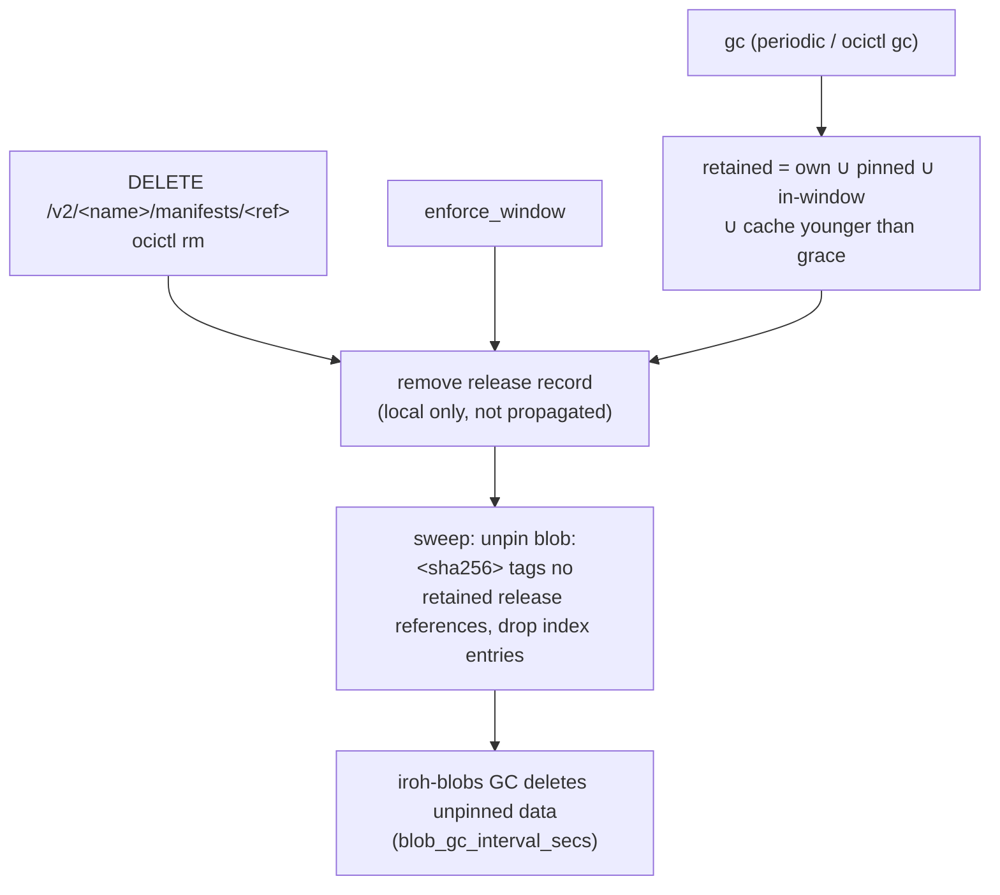

# ocid — design

`ocid` is a local-first, peer-to-peer alternative to centralized OCI
registries: every node runs a loopback OCI registry that standard tooling
(`podman`/`docker`/`oras`) talks to unchanged, while peers exchange signed,
content-addressed releases directly.

The design borrows Radicle's model — keys are identities, signed records
carry trust, replication follows a local policy — mapped onto OCI images:

| Radicle | ocid |
|---|---|
| Ed25519 node id / `did:key` | same key: iroh `EndpointId` + publisher id |
| repository (`rad:z…`) | image `<publisher>/<name>` |
| signed refs | signed **release** record per `name:tag` |
| git objects | OCI blobs (manifest, config, layers, referrers) |
| `git-remote-rad` | embedded OCI v2 registry on `localhost:5050` |
| `rad seed` / `rad follow` | `ocictl seed` / `follow` / `pin` with a retention window |
| gossip announcements | `iroh-gossip`, one topic per publisher |
| fetch protocol | `ocid/sync/1` + `iroh-blobs` |
| `rad node` / `rad` | `ocid` (daemon) / `ocictl` (CLI) |

## Components



Crates: `ocid-core` (library: identity, config/policy, OCI types, release
records, index, API DTOs, optional client) — `ocid` (daemon) — `ocictl` (CLI) — `ocitop` (TUI dashboard).

## Identity and naming



Repository path resolution (hybrid scheme):



Only the key holder can write into a publisher namespace: pushes to
`<other>/…` are refused with 403.

## Data model



* The **signature** covers the canonical JSON of the payload and is made by
  `payload.publisher`; anyone can verify it offline. Records travel as the
  exact JSON bytes that were signed.
* `blobs` lists everything the manifest references transitively (config,
  layers, nested manifests for indexes, referrer manifests and their blobs),
  each with **both** digests. sha256 is what OCI tooling expects; BLAKE3 is
  what iroh-blobs streams and verifies incrementally.
* Newer `timestamp` for the same `(publisher, name, tag)` supersedes.
  Timestamps are seconds; within one second the greater tag sorts newer.
* `referrers` are manifests whose `subject` is this release's manifest
  (signatures, SBOMs, attestations). Attaching one re-signs and republishes
  the release, so referrers replicate with the image they describe.

On disk:

```
blobs/                                      iroh-blobs FsStore (BLAKE3)
index/digests/<sha256>.json                 BlobRef  (sha256 → blake3)
index/releases/<pub>/<name>/<tag>.json      Release
index/referrers/<subject-hex>/<hex>.json    Referrer (for the referrers API)
```

## Publish



A manifest with a `subject` takes a side path: it is stored, recorded under
`index/referrers/<subject>`, and every own release whose manifest is the
subject is re-signed with the new referrer and re-announced.

## Policy and retention windows



* A **mode** is `latest` (= `last:1`), `last:N` or `full`. Several rules for
  one image combine to the widest window; tagged seeds and pins add fixed
  tags.
* `select_wanted` is evaluated against everything the node knows about an
  image — local releases plus what peers' inventories and announcements
  report — so a node with `last:2` fetches the two newest and nothing else.
* `enforce_window` runs after every replication and on policy reload: releases
  outside the window are removed and their blobs unpinned. Own releases and
  pins are never touched.
* Everything the policy does not name is **cache**: on-demand pulls and
  leftovers of removed rules. GC keeps cache for `gc_grace_secs` after it was
  fetched, then drops it. `ocictl gc --force` ignores the grace period.

## Gossip topics



* Every node joins the **swarm topic**. It carries no announcements; it
  supplies neighbors (`NeighborUp` → inventory sync) and bootstrap peers.
* A node subscribes to **its own topic** and to the topic of every publisher
  its policy follows, seeds or pins; `ocictl` reloads the policy in the daemon,
  which joins/leaves topics accordingly. Announcements are broadcast on the
  publisher's topic only, so nodes receive exactly what they can act on.
* A newly reachable peer (swarm neighbor, mDNS, `ocictl connect`) is
  introduced to every subscribed topic; peers not on a topic ignore the join.
* Announcements from a different publisher than the topic's owner are dropped.

## Replicate (policy-driven)



Same logic runs on `NeighborUp`, on mDNS discovery and on `ocictl sync`,
starting from the peer's **Inventory** instead of a single announcement —
this catches up after downtime.

## Pull on demand

```mermaid
sequenceDiagram
    participant P as podman
    participant C as registry (C)
    participant X as peers (neighbors, known, publisher)
    P->>C: GET /v2/&lt;A&gt;/alpine/manifests/3
    C->>C: local release complete? no
    loop candidate peers, until found
        C->>X: sync GetRelease
        X-->>C: Release | None
    end
    C->>X: download blobs (shuffled providers)
    C->>C: verify, index, store release (cache)
    C-->>P: manifest (+ Docker-Content-Digest)
    P->>C: GET blobs/sha256:… (Range supported)
    C-->>P: streamed from store
```

Any node that holds a complete release serves it (seeding): C above can
fetch A's image from B if B replicated it, even if A is offline.

## Deletion and garbage collection



* Blobs are pinned in iroh-blobs under `blob:<sha256>` tags; in-flight
  downloads hold a temp tag so a sweep can't race them, and fetch vs. GC is
  serialised by an RwLock (fetch = read, GC/prune = write).
* `DELETE` on a blob is refused (405): only GC removes data.
* A deleted own release simply stops being announced; peers that already
  replicated it keep it until their own policy drops it.

## Wire protocols

| ALPN | purpose | encoding |
|---|---|---|
| `/iroh-gossip/1` | `Announcement::Release(ReleaseSummary)` on the publisher's topic; membership on the swarm topic | postcard |
| `ocid/sync/1` | `Hello{addr}`, `Inventory`, `GetRelease`, `ListTags` — one bi-stream per request; releases returned as their signed JSON bytes | postcard framing |
| `/iroh-bytes/…` (iroh-blobs) | blob download by BLAKE3 hash with incremental verification | bao |
| mDNS `_ocid._udp.local` | LAN discovery of other ocid endpoints (no tickets needed) | iroh-mdns-address-lookup |

Announcements are deliberately tiny (summary only) so they fit gossip limits;
the signed record is always fetched and verified via `sync`.

## Observability

`GET /metrics` on the registry port serves OpenMetrics text: `ocid_*`
(HTTP requests by method/route/status, bytes served/received, releases
published/replicated/failed, blobs fetched, announcements, sync requests by
type, mDNS discoveries, gossip topics, GC runs/removals, gauges for
neighbors/peers/releases) and iroh's endpoint and gossip metrics (`iroh_*`).

`GET /_ocid/events` serves a Server-Sent Events (SSE) stream of `DaemonEvent`s
(gossip announcements, releases saved, window prunes, peer connections, and HTTP
requests) consumed in real time by `ocitop`.

## Trust boundaries

* **Publisher** is trusted for *what* `name:tag` means (they sign it).
* **Providers** (any peer) are not trusted: BLAKE3 verifies every chunk while
  streaming, sha256 is re-checked after download against the signed record,
  and podman verifies sha256 again on pull.
* **Local registry** has no auth; it binds to loopback. Anyone who can reach
  it can push as you — same trust model as the local podman socket.
* **Deletion** is local. There is no signed tombstone; a publisher cannot
  recall a release from peers who already hold it.

## Testing

* `just test` — unit tests (policy parsing, windows, naming, records).
* `just e2e` — `scripts/e2e.sh` starts two daemons on the host and drives
  them with podman/curl/ocictl (and oras if present): publish, replicate,
  run a container from the replica, on-demand pull, Range/DELETE/metrics,
  follow/seed/pin windows with pruning and topic joins, aliases, GC, offline
  `ocictl`.

## Deferred

* delegation / multi-key publishers (Radicle "delegates"): a publisher is
  exactly one key
* signed tombstones (propagated deletion)
* registry authentication
