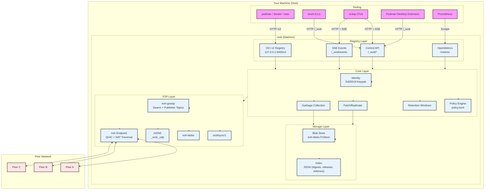
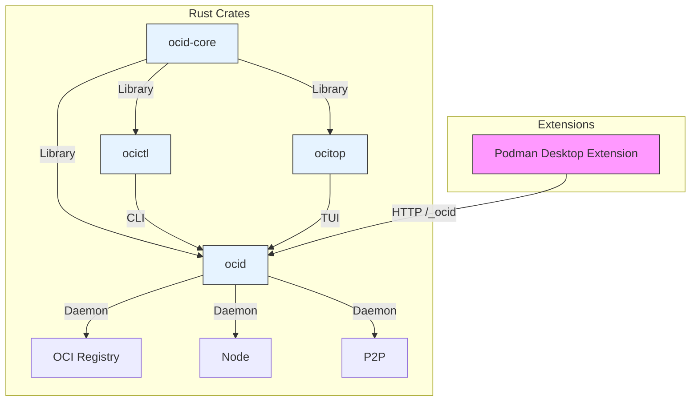
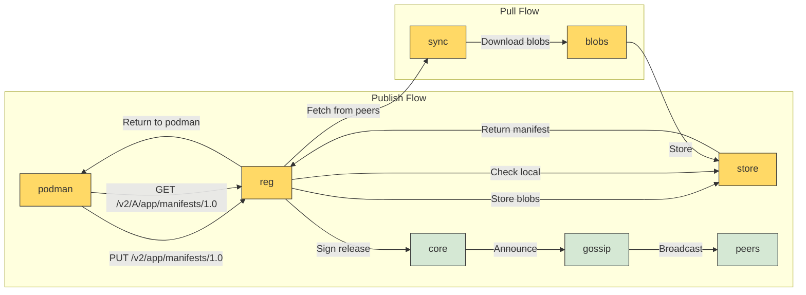
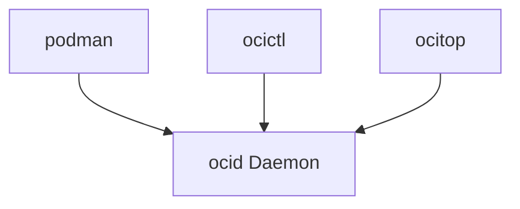
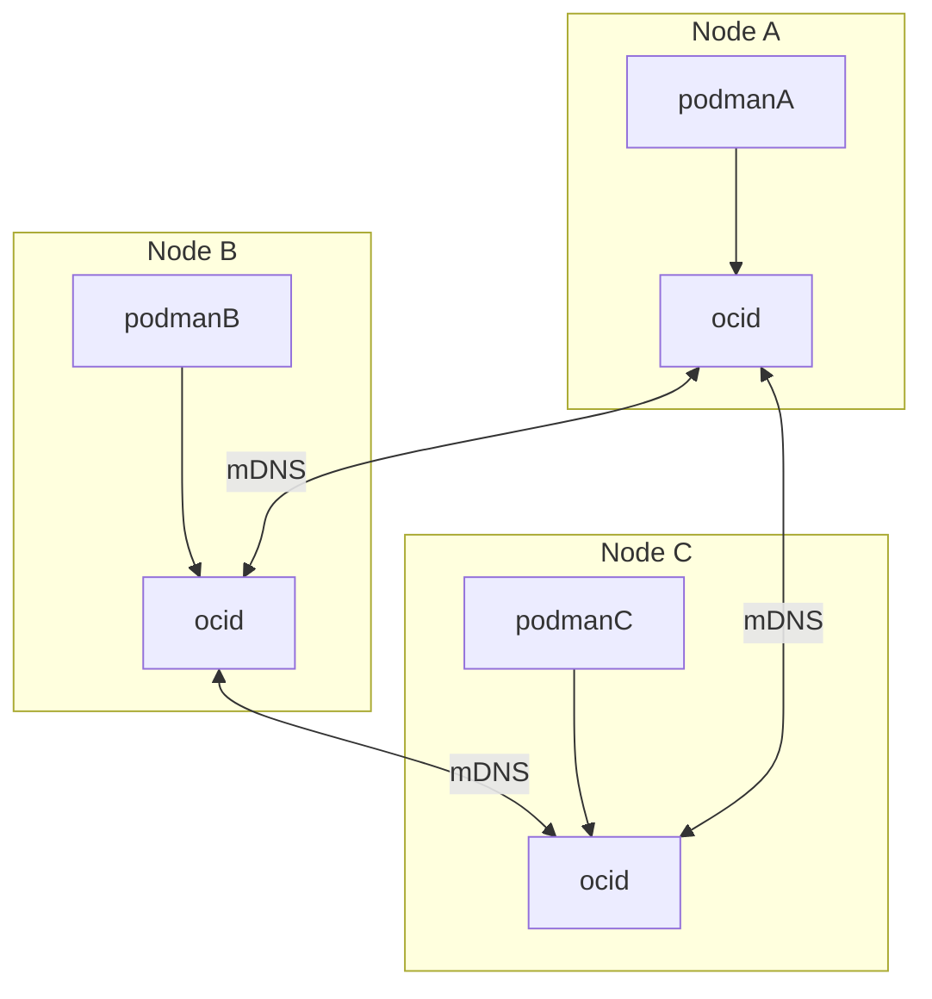
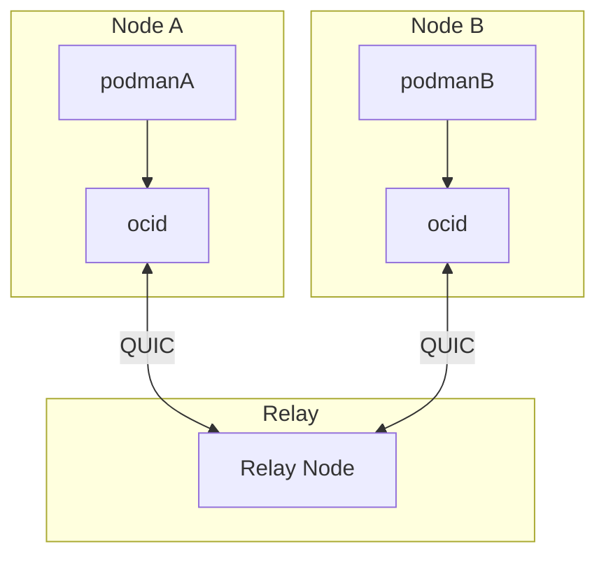

# Components

ocid is a **local-first, peer-to-peer** distribution system for OCI container images. It consists of several components that work together to provide a seamless experience for users of standard OCI tooling (podman, docker, oras) while enabling direct peer-to-peer synchronization.

## High-Level Architecture

The following diagram shows the **high-level architecture** of ocid, including all major components and their interactions:

### Component Descriptions

| Component | Description | Responsibilities |
|-----------|-------------|------------------|
| **OCI Registry** | Embedded OCI v2 registry | Handle `podman/docker/oras` requests, serve manifests/blobs |
| **Control API** | REST API for ocid management | Handle `ocictl` requests, manage policy, peers, releases |
| **OpenMetrics** | Metrics endpoint | Expose Prometheus-compatible metrics for monitoring |
| **SSE Events** | Server-Sent Events | Stream real-time events to `ocitop` and Podman Desktop |
| **Identity** | Ed25519 keypair | Authenticate as a publisher, sign releases |
| **Policy Engine** | Retention policy | Enforce `follow`, `seed`, `pin`, and window rules |
| **Fetch/Replicate** | Replication logic | Fetch releases/blobs from peers, verify signatures |
| **Garbage Collection** | Cleanup | Remove unpinned blobs, enforce retention windows |
| **Blob Store** | iroh-blobs FsStore | Store content-addressed blobs (BLAKE3 hashes) |
| **Index** | JSON index | Map SHA256 digests to BLAKE3 hashes, track releases/referrers |
| **iroh-gossip** | Gossip protocol | Broadcast announcements, discover peers |
| **ocid/sync/1** | Sync protocol | Fetch releases/blobs from peers |
| **iroh-blobs** | Blob transfer | Download/upload blobs with incremental verification |
| **mDNS** | Local discovery | Discover other ocid nodes on the local network |
| **iroh Endpoint** | QUIC endpoint | Handle NAT traversal, hole-punching, relays |

---

## Crate Structure

The ocid project is organized into the following Rust crates:

| Crate | Description | Purpose |
|-------|-------------|---------|
| `ocid-core` | Library crate | Identity, config/policy, OCI types, release records, index, API DTOs |
| `ocid` | Daemon binary | Run iroh endpoint, gossip, blob store, OCI registry, control API |
| `ocictl` | CLI binary | Interact with the daemon over HTTP, manage `policy.toml` |
| `ocitop` | TUI binary | Interactive terminal dashboard for daemon status |
| `podman-desktop` | Extension | Dashboard over the `/_ocid` API (TypeScript + Svelte) |

---

## Data Flow

The following diagram shows how data flows through the system when publishing and pulling images:

---

## Ports and Protocols

ocid uses the following ports and protocols:

| Port | Protocol | Purpose | Direction |
|------|----------|---------|-----------|
| 5050 | HTTP | OCI v2 Registry (`/v2/...`) | Inbound |
| 5050 | HTTP | Control API (`/_ocid/...`) | Inbound |
| 5050 | HTTP | OpenMetrics (`/metrics`) | Inbound |
| 5050 | SSE | Events (`/_ocid/events`) | Outbound |
| 127.0.0.1:0 | QUIC | iroh Endpoint (loopback) | Both |
| *:0 | QUIC | iroh Endpoint (external) | Both |
| UDP 5353 | mDNS | Local discovery (`_ocid._udp`) | Outbound |

---

## Wire Protocols

ocid uses the following wire protocols for communication:

| ALPN | Purpose | Encoding |
|------|---------|----------|
| `/iroh-gossip/1` | Gossip announcements | Postcard |
| `ocid/sync/1` | Sync requests (GetRelease, Inventory) | Postcard |
| `/iroh-bytes/...` | Blob download (BLAKE3 hash) | BAO |
| `mDNS _ocid._udp` | LAN discovery | iroh-mdns-address-lookup |

---

## Deployment Topologies

ocid can be deployed in various topologies:

### Single Node (Development)

### Multi-Node (LAN)

### Multi-Node (WAN with Relays)

