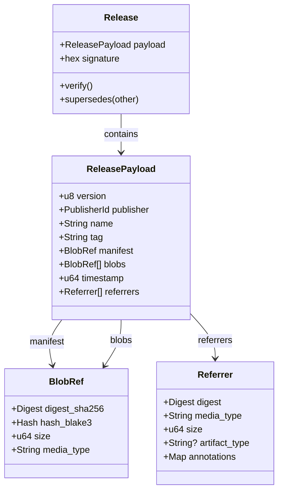
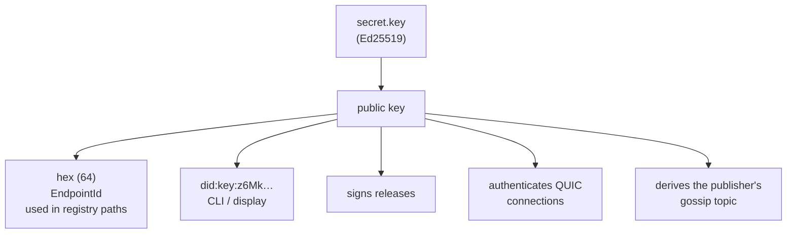
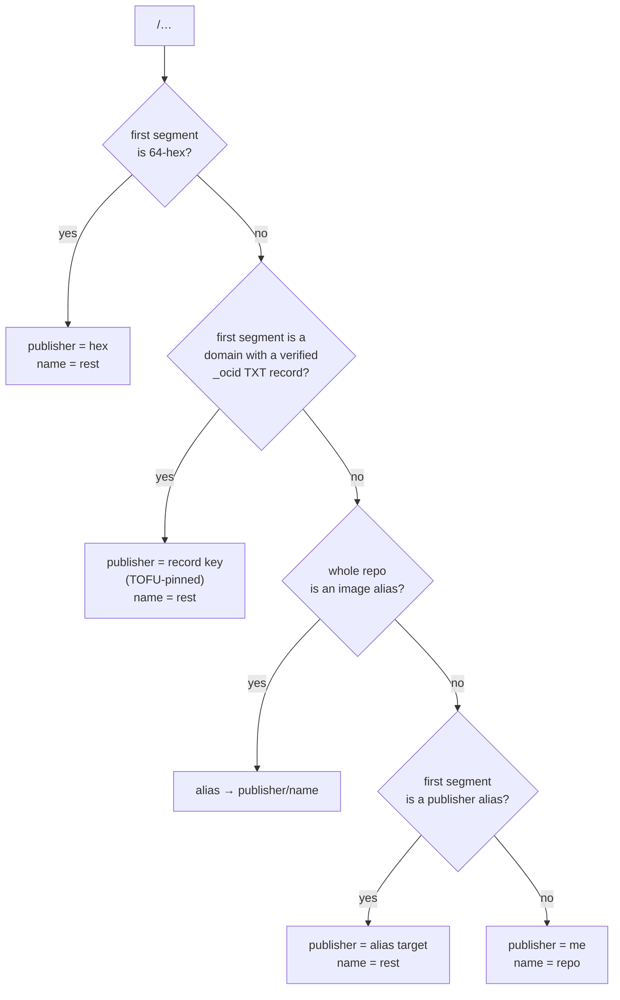
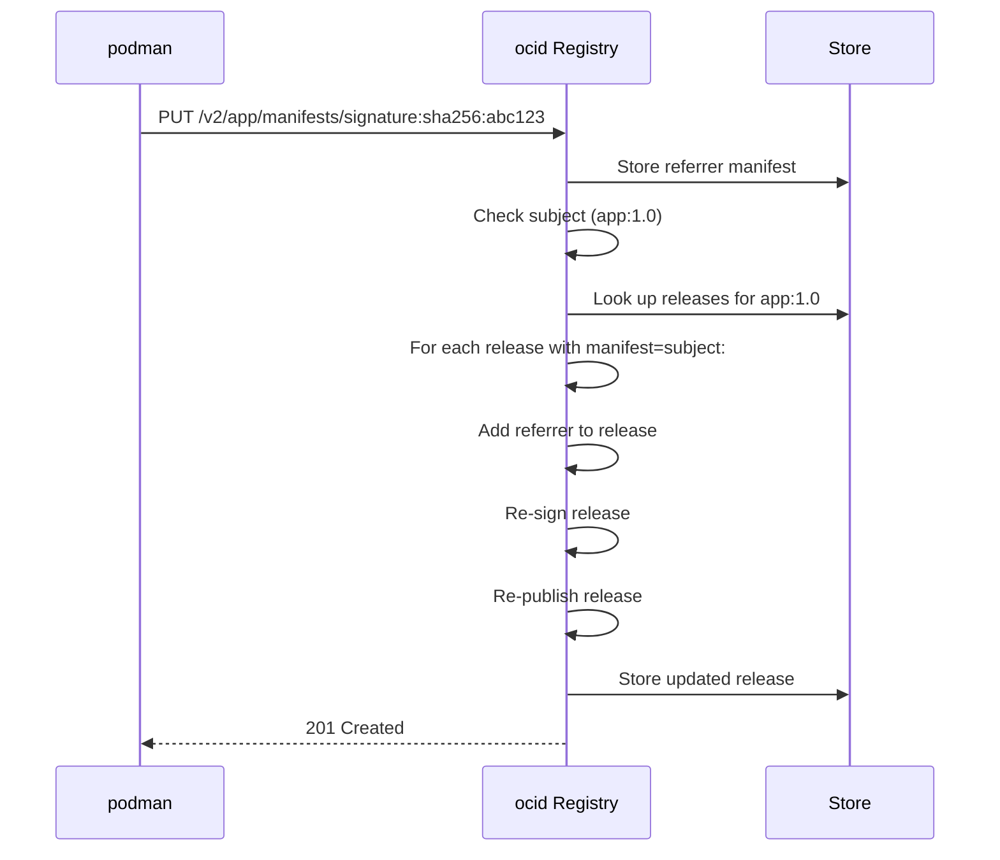

# Data Model

ocid's data model is designed around **content-addressed blobs** and **signed releases**. This ensures that all data can be verified cryptographically and replicated efficiently across peers.

---

## Class Diagram

The following diagram shows the core data structures in ocid:



### Field Descriptions

#### `Release`
| Field | Type | Description |
|-------|------|-------------|
| `payload` | `ReleasePayload` | The signed content of the release |
| `signature` | `hex` | Ed25519 signature over the canonical JSON of the payload |

- The **signature** covers the canonical JSON of the payload and is made by `payload.publisher`.
- Anyone can verify it offline using the publisher's public key.
- Records travel as the exact JSON bytes that were signed.

#### `ReleasePayload`
| Field | Type | Description |
|-------|------|-------------|
| `version` | `u8` | Version of the release format (currently `0`) |
| `publisher` | `PublisherId` | The publisher's Ed25519 public key (also their `EndpointId`) |
| `name` | `String` | The image name (e.g., `app`) |
| `tag` | `String` | The image tag (e.g., `1.0`) |
| `manifest` | `BlobRef` | The OCI manifest blob |
| `blobs` | `BlobRef[]` | All blobs referenced by the manifest (transitively) |
| `timestamp` | `u64` | Unix timestamp (seconds) when the release was created |
| `referrers` | `Referrer[]` | Referrers (signatures, SBOMs, attestations) for this release |

- `blobs` lists **everything the manifest references transitively** (config, layers, nested manifests for indexes, referrer manifests and their blobs).
- Each blob has **both digests**: `sha256` (what OCI tooling expects) and `blake3` (what iroh-blobs streams and verifies incrementally).
- Newer `timestamp` for the same `(publisher, name, tag)` **supersedes** the older one.
- Timestamps are in seconds; within one second, the greater tag sorts newer.
- `referrers` are manifests whose `subject` is this release's manifest. Attaching one **re-signs and republishes** the release, so referrers replicate with the image they describe.

#### `BlobRef`
| Field | Type | Description |
|-------|------|-------------|
| `digest_sha256` | `Digest` | SHA256 digest (for OCI compatibility) |
| `hash_blake3` | `Hash` | BLAKE3 hash (for iroh-blobs) |
| `size` | `u64` | Size of the blob in bytes |
| `media_type` | `String` | MIME type of the blob (e.g., `application/vnd.oci.image.manifest.v1+json`) |

#### `Referrer`
| Field | Type | Description |
|-------|------|-------------|
| `digest` | `Digest` | SHA256 digest of the referrer manifest |
| `media_type` | `String` | MIME type of the referrer |
| `size` | `u64` | Size of the referrer in bytes |
| `artifact_type` | `String?` | Type of artifact (e.g., `cosign/signature`) |
| `annotations` | `Map` | Arbitrary annotations (key-value pairs) |

---

## On-Disk Layout

ocid stores all data on disk in the following structure under `$OCID_HOME`:

```
$OCID_HOME/
├── blobs/                          # iroh-blobs FsStore (content-addressed by BLAKE3)
│   └── <blake3-hash>/              # Raw blob data
├── index/
│   ├── digests/
│   │   └── <sha256>.json           # BlobRef (maps SHA256 → BLAKE3)
│   ├── releases/
│   │   └── <publisher>/
│   │       └── <name>/
│   │           └── <tag>.json      # Release (signed JSON)
│   └── referrers/
│       └── <subject-hex>/
│           └── <hex>.json          # Referrer (for the referrers API)
├── config.toml                     # Daemon configuration
├── policy.toml                     # Retention policy
├── identity.key                    # Secret key (Ed25519)
├── identity.pub                    # Public key (Ed25519)
└── dns-pins.json                   # TOFU-pinned DNS publisher names
```

### Example

For a release `z6MkqRYqQ.../app:1.0` with:
- Manifest SHA256: `sha256:abc123...`
- Manifest BLAKE3: `blake3:def456...`
- Layer SHA256: `sha256:789xyz...`
- Layer BLAKE3: `blake3:uvw123...`

The on-disk structure would be:
```
$OCID_HOME/
├── blobs/
│   ├── def456...    # Manifest blob (BLAKE3)
│   └── uvw123...    # Layer blob (BLAKE3)
├── index/
│   ├── digests/
│   │   ├── abc123.json  # { digest_sha256: "sha256:abc123...", hash_blake3: "blake3:def456...", size: 1024, media_type: "application/vnd.oci.image.manifest.v1+json" }
│   │   └── 789xyz.json  # { digest_sha256: "sha256:789xyz...", hash_blake3: "blake3:uvw123...", size: 2048, media_type: "application/vnd.oci.image.layer.v1.tar+gzip" }
│   └── releases/
│       └── z6MkqRYqQ.../
│           └── app/
│               └── 1.0.json  # Signed Release JSON
└── identity.key
```

---

## Identity and Naming

### Identity

ocid uses **Ed25519 keypairs** for identity. The same key serves multiple purposes:



| Key Format | Usage | Example |
|------------|-------|---------|
| Hex (64 chars) | Registry paths, gossip topics | `z6MkqRYqQ...` |
| `did:key:` | CLI display, DID | `did:key:z6MkqRYqQ...` |
| Raw bytes | Signing, verification | `[u8; 32]` |

### Naming Resolution

ocid uses a **hybrid naming scheme** to resolve repository paths:



#### Examples

| Repository Path | Resolved Publisher | Resolved Name | Notes |
|-----------------|--------------------|---------------|-------|
| `z6MkqRYqQ.../app:1.0` | `z6MkqRYqQ...` | `app` | Explicit hex publisher |
| `images.example.com/app:1.0` | `z6MkqRYqQ...` (from DNS) | `app` | DNS publisher name |
| `myapp:1.0` | `me` | `myapp` | Implicit self |
| `alias/app:1.0` | `z6MkqRYqQ...` (from alias) | `app` | Publisher alias |

#### DNS Publisher Names

A domain name (e.g., `images.example.com`) can stand in for the hex publisher ID via a **signed TXT record** at `_ocid.<zone>`:

```
_ocid.images.example.com. 300 IN TXT "v=ocid1 k=<64-hex> ts=<unix> sig=<128-hex>"
```

- **`k`**: The publisher's hex-encoded Ed25519 public key.
- **`ts`**: Unix timestamp (seconds) when the record was created.
- **`sig`**: Ed25519 signature by the key over the canonical payload `ocid1 <zone> <k> <ts>`.

**Trust Model:**
- DNS is **untrusted**; the signature is always verified.
- The zone is part of the signed bytes (a record cannot be replayed across zones).
- **Freshness**: Records older than `dns_max_age_secs` (default 30 days) are rejected.
- **TOFU pinning**: The first verified resolution pins the key in `$OCID_HOME/dns-pins.json`.
- **Rotation**: Explicit via `ocictl dns-unpin <zone>`, then the next resolve re-pins.

---

## Referrers (OCI 1.1)

ocid supports **OCI Distribution Specification 1.1 referrers**, which are manifests that reference another manifest as their `subject`. This is used for:
- **Signatures** (e.g., cosign)
- **SBOMs** (Software Bill of Materials)
- **Attestations** (e.g., SLSA, in-toto)

### Referrer Flow



- When a referrer is pushed, ocid **automatically attaches it to all local releases** whose manifest is the referrer's `subject`.
- The release is **re-signed and re-published** to ensure referrers replicate with the image they describe.
- Referrers are stored under `index/referrers/<subject-hex>/<hex>.json`.

---

## Blob Addressing

ocid uses **two hash algorithms** for blob addressing:

| Hash | Purpose | Used By |
|------|---------|---------|
| SHA256 | OCI compatibility | podman, docker, oras |
| BLAKE3 | iroh-blobs | ocid, iroh |

### Why Two Hashes?

1. **SHA256**: Required by the OCI spec for manifest digests and client verification.
2. **BLAKE3**: Used by iroh-blobs for:
   - **Incremental verification**: Verify chunks as they stream.
   - **Content addressing**: iroh-blobs uses BLAKE3 for its internal store.
   - **Performance**: BLAKE3 is faster than SHA256.

### Mapping

The `index/digests/<sha256>.json` file maps SHA256 digests to BLAKE3 hashes:

```json
{
  "digest_sha256": "sha256:abc123...",
  "hash_blake3": "blake3:def456...",
  "size": 1024,
  "media_type": "application/vnd.oci.image.manifest.v1+json"
}
```

This allows ocid to:
1. Accept OCI requests with SHA256 digests.
2. Look up the BLAKE3 hash for iroh-blobs.
3. Verify both hashes after download.
