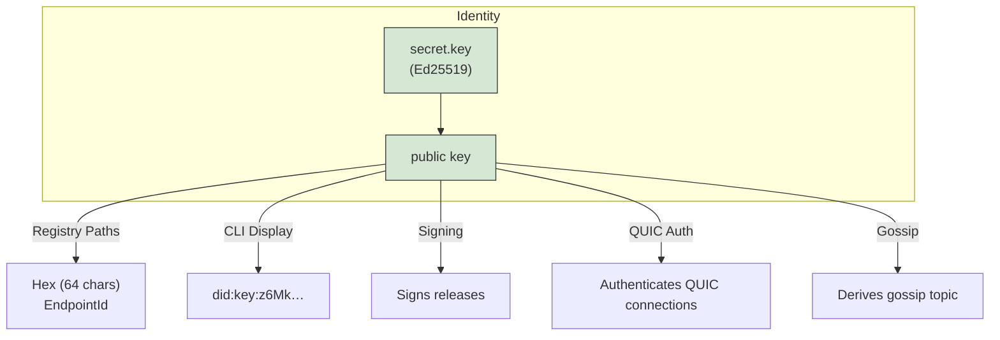
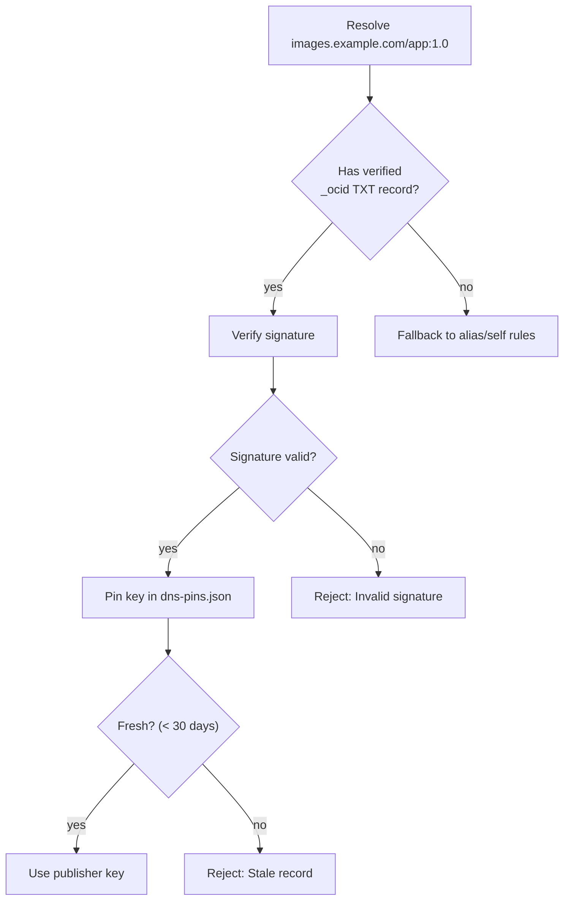
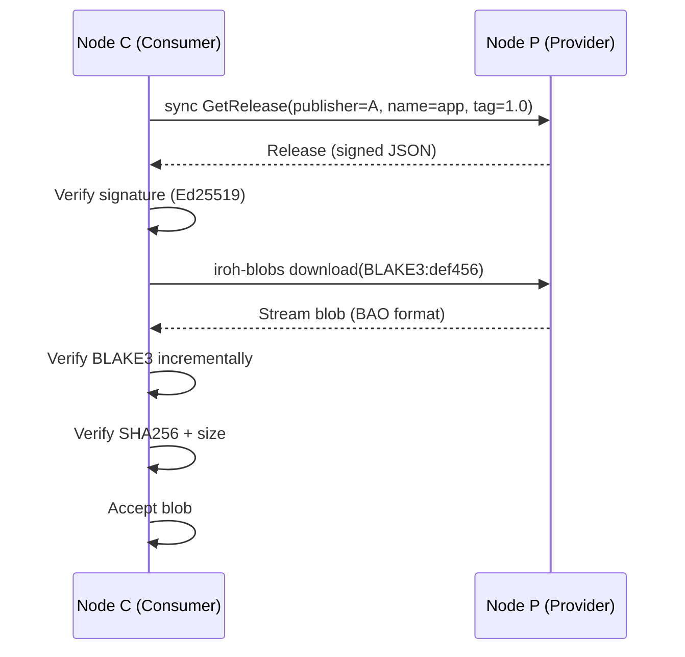
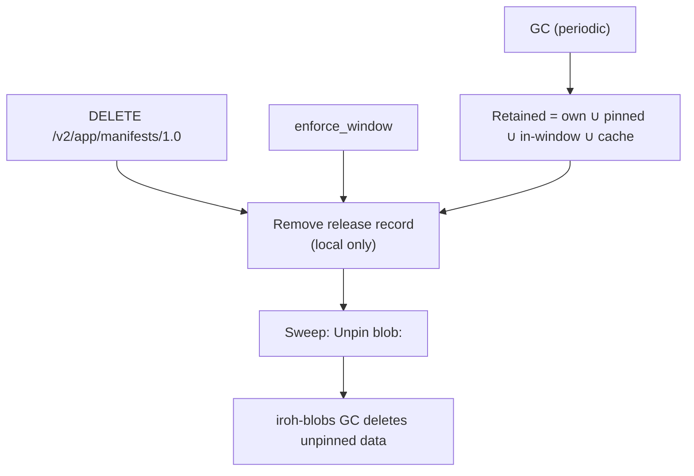

# Trust Model

ocid is designed with **explicit trust boundaries** to ensure security in a peer-to-peer environment. This document describes what is trusted, what isn’t, and how ocid verifies data at each step.

---

## 🔐 Trust Boundaries

The following table summarizes the trust model for each component in ocid:

| Component | Trust Level | Notes |
|-----------|-------------|-------|
| **Publisher** | ✅ Trusted | Signs releases; defines what `name:tag` means. |
| **DNS** | ❌ Untrusted | `_ocid` TXT records are unverified claims until signature checks + TOFU pin. |
| **Providers (Peers)** | ❌ Untrusted | BLAKE3 verifies chunks during streaming; SHA256 re-checked after download. |
| **Local Registry** | ⚠️ Limited | No auth; binds to loopback. Same trust model as local podman socket. |
| **TLS** | ✅ Encrypted | Self-signed CA under `$OCID_HOME/tls` (transport encryption, not authentication). |
| **Deletion** | ❌ Local | No signed tombstones; publishers cannot recall releases from peers. |

---

## 🔑 Publisher Trust

The **publisher** is the **root of trust** in ocid. A publisher is identified by their **Ed25519 public key**, which serves multiple purposes:



### What a Publisher Can Do

| Action | Allowed? | Notes |
|--------|----------|-------|
| Publish releases | ✅ Yes | Only the key holder can sign releases for their namespace. |
| Define `name:tag` | ✅ Yes | The publisher defines what `name:tag` means (e.g., `app:1.0`). |
| Overwrite releases | ✅ Yes | Newer timestamps supersede older ones for the same `(publisher, name, tag)`. |
| Delete releases | ❌ No | Deletion is local; no propagated tombstones. |
| Recall releases | ❌ No | Peers that already replicated a release keep it. |

### Publisher Verification

When a node receives a release from a publisher:
1. It **verifies the signature** using the publisher’s public key.
2. It checks that the **publisher matches the expected key** (from DNS, alias, or direct hex).
3. It ensures the **timestamp is newer** than any existing release for `(publisher, name, tag)`.

---

## 🌍 DNS Publisher Names

ocid supports **DNS publisher names**, which allow a domain (e.g., `images.example.com`) to stand in for a publisher’s hex ID. This is useful for human-readable names but requires careful trust management.

### DNS Record Format

A DNS publisher name is defined by a **signed TXT record** at `_ocid.<zone>`:

```
_ocid.images.example.com. 300 IN TXT "v=ocid1 k=<64-hex> ts=<unix> sig=<128-hex>"
```

| Field | Description | Example |
|-------|-------------|---------|
| `v` | Version (currently `ocid1`) | `ocid1` |
| `k` | Publisher’s hex-encoded Ed25519 public key | `z6MkqRYqQ...` |
| `ts` | Unix timestamp (seconds) when the record was created | `1712345678` |
| `sig` | Ed25519 signature by the key over the canonical payload | `abc123...` |

### Signature Payload

The signature covers the **canonical payload**:
```
ocid1 <zone> <k> <ts>
```

Example:
```
ocid1 images.example.com z6MkqRYqQ... 1712345678
```

### Trust Model for DNS

DNS is **not trusted** by default. ocid uses the following mechanisms to ensure security:

1. **Signature Verification**:
   - The signature is **always verified** before accepting the DNS record.
   - The zone is part of the signed bytes, so a record **cannot be replayed across zones**.

2. **Freshness**:
   - Records older than `dns_max_age_secs` (default: 30 days) are **rejected**.

3. **TOFU Pinning**:
   - The first verified resolution **pins the key** in `$OCID_HOME/dns-pins.json`.
   - A later record for the same zone with a **different key is rejected** as a possible hijack.
   - **Rotation is explicit**: Use `ocictl dns-unpin <zone>` to unpin, then the next resolve re-pins.

4. **Cache**:
   - Positive and negative lookups are **cached briefly** (TTL-capped).
   - Errors are **never cached**, so every pull re-checks a bad record.

### DNS Resolution Flow



### DNS Commands

| Command | Description |
|---------|-------------|
| `ocictl dns-record <zone>` | Generate a DNS TXT record for the current node’s key. |
| `ocictl resolve <zone>` | Resolve a DNS publisher name and show the pinned key. |
| `ocictl dns-unpin <zone>` | Unpin a DNS publisher name (allow rotation). |

---

## 👥 Provider (Peer) Trust

**Providers** (any peer in the network) are **not trusted** by default. ocid uses the following mechanisms to ensure data integrity:

### Blob Verification

1. **BLAKE3 Incremental Verification**:
   - iroh-blobs **verifies every chunk** as it streams using BLAKE3.
   - This ensures that the data received matches the expected hash **before** the entire blob is downloaded.

2. **SHA256 Final Verification**:
   - After download, ocid **re-checks the SHA256 digest** against the signed release.
   - This ensures compatibility with OCI tooling (which expects SHA256).

3. **Size Verification**:
   - The size of each blob is **verified** against the `BlobRef` in the release.

### Release Verification

1. **Signature Verification**:
   - Every release is **signed by the publisher**.
   - ocid verifies the signature using the publisher’s public key **before** accepting the release.

2. **Timestamp Verification**:
   - ocid checks that the **timestamp is newer** than any existing release for `(publisher, name, tag)`.
   - This prevents replay attacks.

3. **Blob Completeness**:
   - ocid checks that **all blobs referenced by the release** are present and verified.

### Provider Flow



---

## 🏠 Local Registry Trust

The **local OCI registry** (on `127.0.0.1:5050`) has **no authentication**. This is intentional and matches the trust model of the local podman socket:

| Action | Allowed? | Notes |
|--------|----------|-------|
| Push to own namespace | ✅ Yes | Anyone with access to the local registry can push as the local node. |
| Push to other namespaces | ❌ No | Pushes to `<other>/...` are refused with `403 Forbidden`. |
| Pull from any namespace | ✅ Yes | Pulls are allowed for any namespace. |
| Delete manifests | ✅ Yes | Deletion is local; only removes the release record. |

### Security Implications

- **Local access = Full control**: Anyone who can reach the local registry can push as the local node.
- **Same as podman socket**: This matches the trust model of the local podman socket (`/run/podman/podman.sock`).
- **Mitigation**: Bind to `127.0.0.1` (loopback) to prevent external access.

### TLS Support

ocid can serve the registry over **HTTPS with a self-signed CA**:

```bash
# Enable TLS (auto-generates CA)
ocid --tls
```

- The CA is stored in `$OCID_HOME/tls/`.
- The certificate is **self-signed** and provides **transport encryption** (not authentication).
- Clients must **pin the CA** to verify the server.

---

## 🗑️ Deletion Trust

Deletion in ocid is **local only**. There are **no signed tombstones**, and publishers cannot recall releases from peers:

| Action | Scope | Propagated? |
|--------|-------|-------------|
| `DELETE /v2/<name>/manifests/<ref>` | Local | ❌ No |
| `ocictl rm <ref>` | Local | ❌ No |
| `enforce_window` | Local | ❌ No |
| `ocictl gc` | Local | ❌ No |

### Deletion Flow



### Implications

1. **No Propagated Deletion**:
   - Deleting a release on Node A **does not** remove it from Node B.
   - Peers that already replicated the release **keep it** until their own policy drops it.

2. **Stop Announcing**:
   - Deleting a release **stops it from being announced** on the publisher’s gossip topic.
   - Peers will **not receive new announcements** for the deleted release.

3. **Local Cleanup**:
   - `DELETE` on a blob is **refused (405 Method Not Allowed)**.
   - Only **GC** can remove blobs (when they are unpinned).

---

## 🔒 Security Summary

| Threat | Mitigation |
|--------|------------|
| **Malicious Publisher** | Signatures verify publisher identity; peers can only push to their own namespace. |
| **Malicious Peer** | BLAKE3 + SHA256 verification ensures data integrity; signatures verify release authenticity. |
| **DNS Spoofing** | TOFU pinning + signature verification prevents hijacking. |
| **Replay Attacks** | Timestamps + newer supersedes prevent replay of old releases. |
| **Local Access** | Bind to loopback; same trust model as podman socket. |
| **Data Corruption** | Incremental verification (BLAKE3) + final verification (SHA256) ensures integrity. |
| **Denial of Service** | Rate limiting (not yet implemented); timeouts for slow peers. |

---

## 🛡️ Best Practices

### For Publishers

1. **Keep Your Key Safe**:
   - The secret key (`identity.key`) is the **root of trust** for your namespace.
   - Back it up securely and **never share it**.

2. **Use DNS Publisher Names Carefully**:
   - DNS records are **untrusted** until verified.
   - Rotate DNS records **explicitly** (`ocictl dns-unpin`).

3. **Pin Critical Releases**:
   - Use `ocictl pin <ref>` to ensure critical releases are **never pruned**.

### For Consumers

1. **Verify DNS Records**:
   - Use `ocictl resolve <zone>` to check the pinned key for a DNS publisher name.

2. **Use Policy Wisely**:
   - `follow` publishers you trust.
   - `seed` images you care about.
   - `pin` critical releases.

3. **Monitor Peers**:
   - Use `ocictl peers` to see connected peers.
   - Use `ocitop` to monitor real-time activity.

### For Operators

1. **Bind to Loopback**:
   - Ensure the registry is **only accessible locally** (`127.0.0.1:5050`).

2. **Enable TLS**:
   - Use `--tls` to enable HTTPS with a self-signed CA.
   - Distribute the CA to clients for pinning.

3. **Monitor Metrics**:
   - Use Prometheus + Grafana to monitor `/metrics`.
   - Set up alerts for unusual activity.
