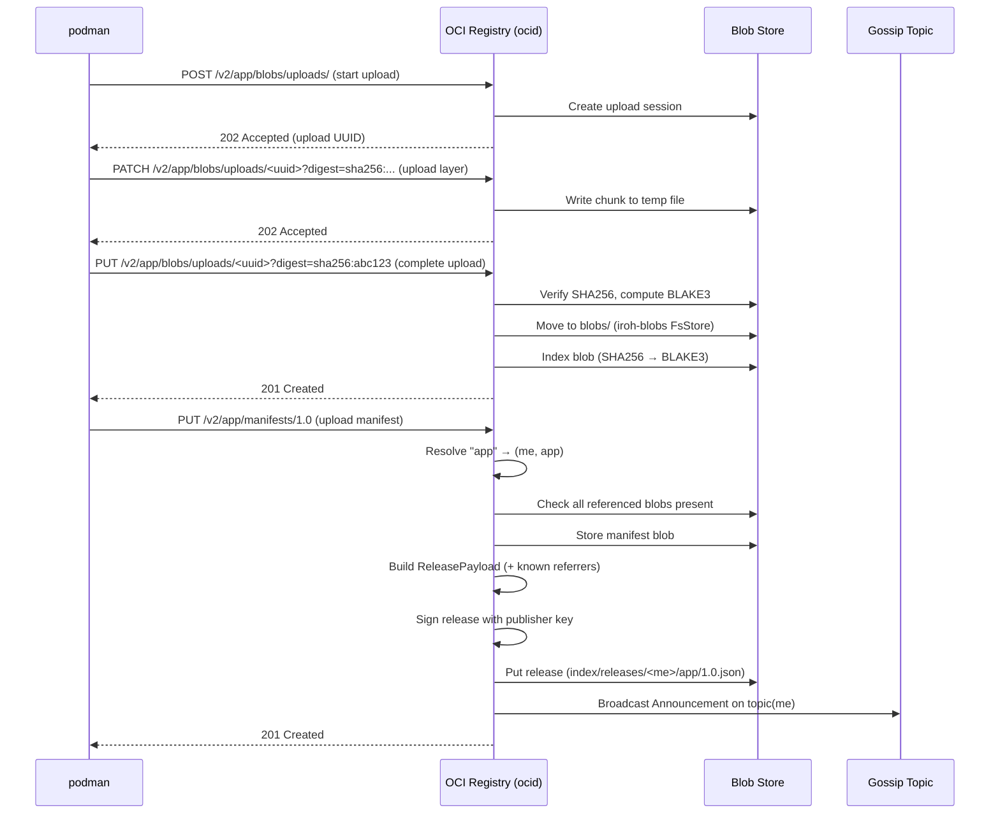
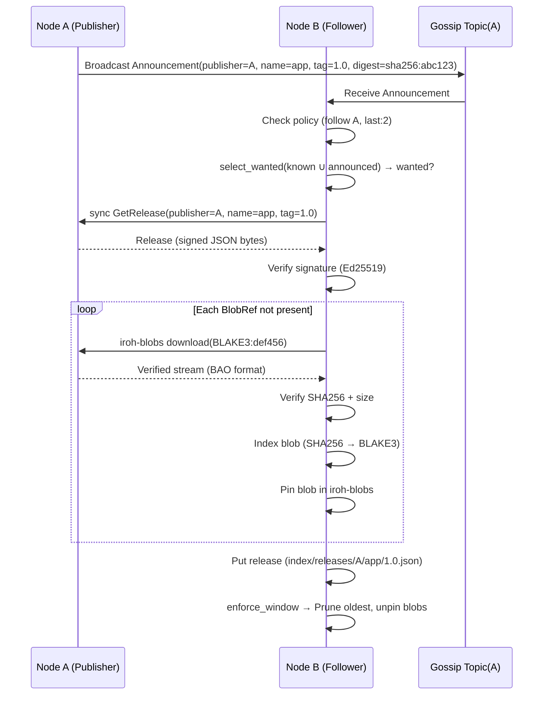
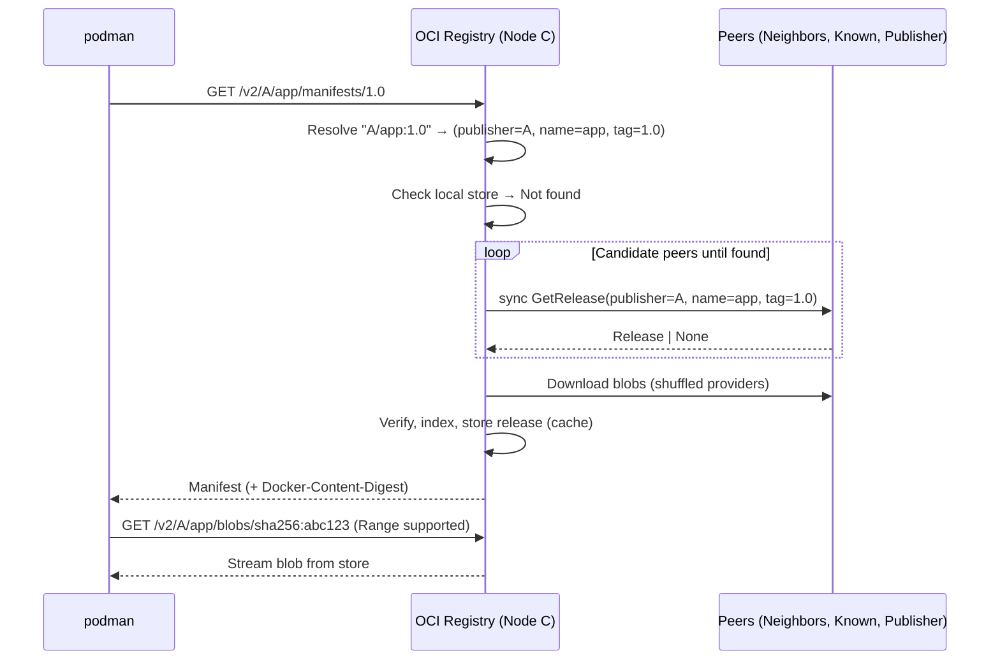
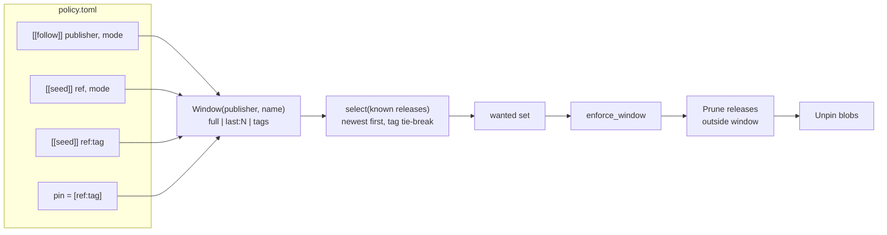
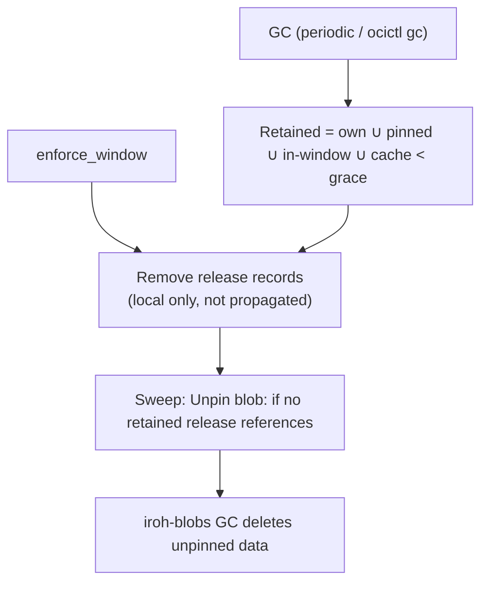
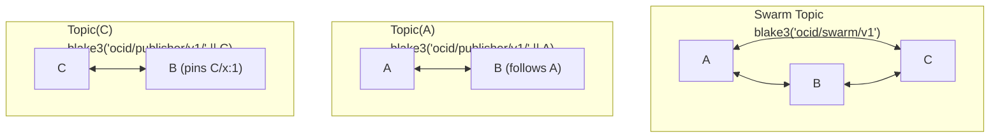
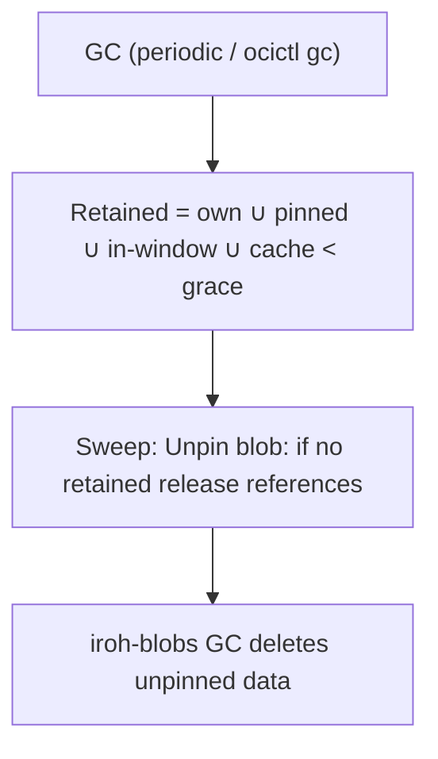
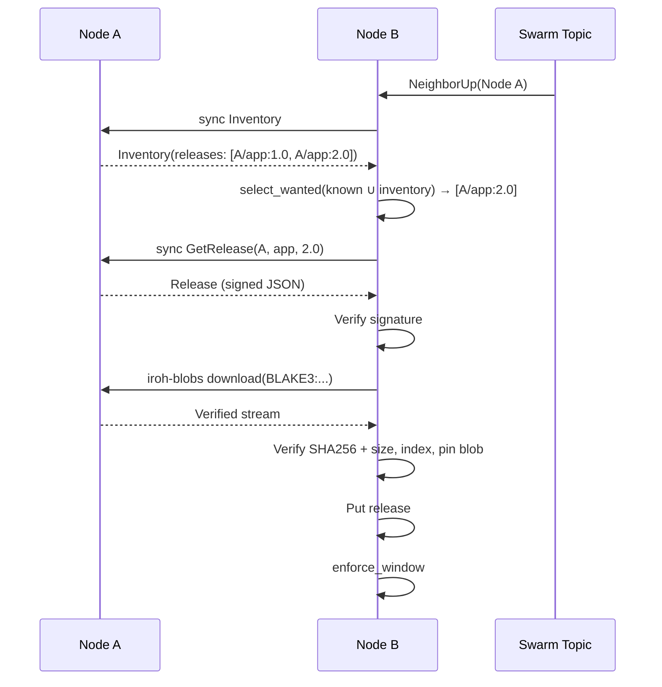
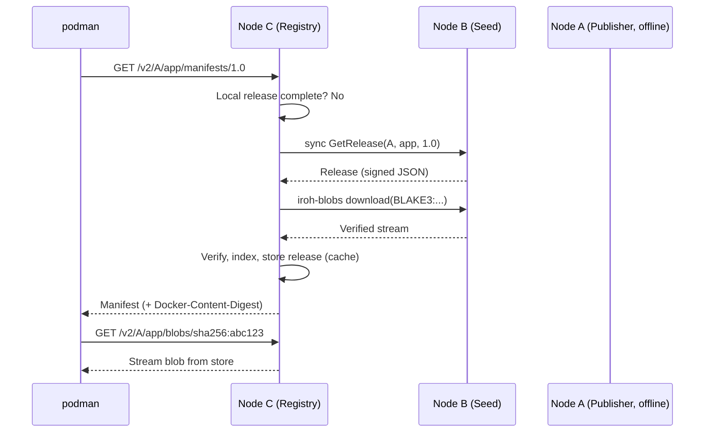

# Workflows

ocid implements several **key workflows** for distributing OCI images in a peer-to-peer manner. This document describes each workflow in detail, including the steps involved and the interactions between components.

---

## 📤 Publish Flow

When a user pushes an image to ocid (e.g., `podman push localhost:5050/app:1.0`), the following steps occur:



### Steps Explained

1. **Upload Blobs**:
   - podman starts an upload session for each layer/config/blob.
   - ocid writes chunks to a temporary file.
   - On completion, ocid verifies the SHA256 digest, computes the BLAKE3 hash, and moves the blob to the iroh-blobs store.
   - The blob is indexed in `index/digests/<sha256>.json` (maps SHA256 → BLAKE3).

2. **Upload Manifest**:
   - podman pushes the manifest (e.g., `app:1.0`).
   - ocid resolves the repository name (`app`) to `(publisher=me, name=app)`.
   - ocid checks that all blobs referenced by the manifest are present.
   - ocid stores the manifest blob (same process as layers).

3. **Sign and Publish Release**:
   - ocid builds a `ReleasePayload` with the manifest and all referenced blobs.
   - ocid signs the payload with the publisher's Ed25519 key.
   - The signed release is stored in `index/releases/<me>/app/1.0.json`.
   - ocid broadcasts an `Announcement` on the publisher's gossip topic (`topic(me)`).

4. **Referrers (OCI 1.1)**:
   - If the manifest has a `subject` field (e.g., for signatures), ocid:
     1. Stores the referrer manifest.
     2. Records it under `index/referrers/<subject>/<hash>.json`.
     3. Re-signs and re-publishes all local releases whose manifest is the subject.

---

## 🔄 Replication Flow

When a node receives a **gossip announcement** for a release it doesn’t have (or doesn’t have completely), it fetches the release from a peer:



### Steps Explained

1. **Receive Announcement**:
   - Node B receives a gossip announcement from Node A’s topic (`topic(A)`).
   - The announcement contains a `ReleaseSummary` (publisher, name, tag, digest, timestamp).

2. **Check Policy**:
   - Node B checks if the release matches its policy:
     - `follow A`: Subscribe to `topic(A)` and fetch all new releases from A.
     - `seed app`: Subscribe to `topic(A)` and fetch all releases for `app`.
     - `pin app:1.0`: Always keep `app:1.0` (never prune).
     - `last:2`: Keep only the 2 newest releases for `app`.

3. **Fetch Release**:
   - If the release is wanted, Node B sends a `sync.GetRelease` request to Node A.
   - Node A returns the **signed JSON bytes** of the release.
   - Node B verifies the signature using Node A’s public key.

4. **Download Blobs**:
   - For each `BlobRef` in the release that Node B doesn’t have:
     - Node B downloads the blob from Node A using `iroh-blobs` (BLAKE3 hash).
     - The blob is streamed with **incremental verification** (BAO format).
     - Node B verifies the SHA256 digest and size against the signed release.
     - The blob is indexed and pinned in iroh-blobs.

5. **Store and Enforce**:
   - The release is stored in `index/releases/A/app/1.0.json`.
   - Node B runs `enforce_window` to prune releases outside the policy window.

---

## 📥 Pull Flow (On-Demand)

When a user pulls an image that isn’t available locally (e.g., `podman pull localhost:5050/A/app:1.0`), ocid fetches it from a peer on demand:



### Steps Explained

1. **Resolve Repository**:
   - Node C resolves `A/app:1.0` to `(publisher=A, name=app, tag=1.0)`.
   - If `A` is a DNS publisher name, it resolves to the pinned key.

2. **Check Local Store**:
   - Node C checks if it has the release locally.
   - If not, it proceeds to fetch from peers.

3. **Fetch from Peers**:
   - Node C iterates through **candidate peers** (neighbors, known peers, publisher).
   - For each peer, it sends a `sync.GetRelease` request.
   - The first peer to return the release wins.

4. **Download Blobs**:
   - Node C downloads all blobs referenced by the release from **shuffled providers** (any peer that has them).
   - Blobs are verified (SHA256 + size) and stored in the cache.

5. **Return to Client**:
   - Node C returns the manifest to podman with the `Docker-Content-Digest` header.
   - podman then requests individual blobs (with Range support).

---

## 📜 Policy and Retention

ocid uses a **policy-based retention system** to manage which releases are kept locally. The policy is defined in `policy.toml`:

```toml
[[follow]]
publisher = "z6MkqRYqQ..."
mode = "last:2"

[[seed]]
ref = "app"
mode = "full"

[[pin]]
ref = "app:1.0"
```

### Policy Workflow



### Modes

| Mode | Description | Example |
|------|-------------|---------|
| `latest` | Keep the newest release | `mode = "latest"` (same as `last:1`) |
| `last:N` | Keep the N newest releases | `mode = "last:2"` |
| `full` | Keep all releases | `mode = "full"` |
| `tags` | Keep specific tags | `mode = "tags"` (with `tags = ["1.0", "2.0"]`) |

### Rules

1. **Multiple rules for one image combine to the widest window**.
   - Example: `follow A` with `last:2` + `seed app` with `full` → keep all releases for `app`.

2. **Pins are never pruned**.
   - Example: `pin app:1.0` → `app:1.0` is always retained, even if outside the window.

3. **Own releases are never pruned**.
   - Releases published by the local node are always kept.

4. **Cache is temporary**.
   - Releases fetched on-demand (not via policy) are kept for `gc_grace_secs` (default: 30 days).

### Enforcement



---

## 🌐 Gossip and Sync

ocid uses **iroh-gossip** for peer discovery and announcement propagation. Each publisher has its own **gossip topic**, and nodes subscribe to topics for publishers they follow/seed/pin.

### Gossip Topics



### Topic Rules

1. **Swarm Topic**:
   - Every node joins the swarm topic.
   - Carries **no announcements**; only supplies neighbors (`NeighborUp` → inventory sync) and bootstrap peers.

2. **Publisher Topics**:
   - A node subscribes to its **own topic** and to the topic of every publisher its policy follows, seeds, or pins.
   - Announcements are broadcast **only on the publisher's topic**.
   - Nodes receive exactly what they can act on (based on their policy).

3. **Peer Introduction**:
   - A newly reachable peer (swarm neighbor, mDNS, `ocictl connect`) is introduced to every subscribed topic.
   - Peers not on a topic ignore the join.

4. **Announcement Validation**:
   - Announcements from a different publisher than the topic’s owner are **dropped**.

---

## 🗑️ Garbage Collection

ocid performs **garbage collection (GC)** to clean up unpinned blobs and releases outside the policy window.

### GC Flow



### GC Rules

1. **Retained Blobs**:
   - Blobs referenced by **own releases**.
   - Blobs referenced by **pinned releases**.
   - Blobs referenced by **in-window releases**.
   - Blobs referenced by **cache releases** (fetched within `gc_grace_secs`).

2. **Sweep**:
   - Unpin blobs not referenced by any retained release.
   - iroh-blobs GC deletes unpinned blobs.

3. **In-Flight Protection**:
   - Downloads hold a **temp tag** in iroh-blobs to prevent race conditions.
   - Fetch and GC are serialized by an `RwLock` (fetch = read, GC/prune = write).

4. **Manual GC**:
   - Run `ocictl gc` to trigger GC manually.
   - Use `ocictl gc --force` to ignore the grace period.

---

## 🔄 Inventory Sync

When a new peer is discovered (via swarm topic or mDNS), ocid performs an **inventory sync** to catch up on missed releases:



### Steps Explained

1. **Neighbor Discovery**:
   - Node B receives a `NeighborUp` event from the swarm topic (Node A joined).

2. **Inventory Request**:
   - Node B sends a `sync.Inventory` request to Node A.
   - Node A returns a list of all releases it knows about.

3. **Select Wanted**:
   - Node B runs `select_wanted` on the union of its known releases and Node A’s inventory.
   - This determines which releases Node B needs to fetch.

4. **Fetch Releases**:
   - Node B fetches each wanted release from Node A (same as the replication flow).

---

## 🔍 On-Demand Pull with Seeding

Any node that holds a **complete release** can serve it, even if it wasn’t the original publisher. This is called **seeding**:



### Key Points

- Node C can fetch `A/app:1.0` from Node B, even if Node A (the publisher) is offline.
- Node B must have **replicated the release** from Node A earlier (via gossip or sync).
- The release is stored in **cache** on Node C (subject to GC after `gc_grace_secs`).
