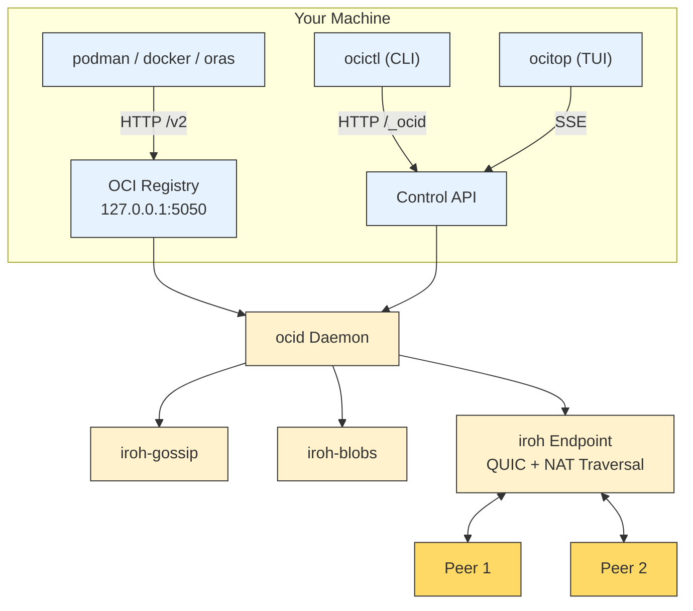

# ocid: Local-First, Peer-to-Peer OCI Image Distribution

!!! quote "ocid is a **Radicle-style**, local-first, peer-to-peer alternative to centralized OCI registries."

ocid (pronounced "oh-seed") lets you **push, pull, and share container images directly between peers** — no central registry required. Every node runs its own **loopback OCI registry** that standard tooling (`podman`, `docker`, `oras`) talks to unchanged, while peers exchange **signed, content-addressed releases** directly.

---

## 🚀 Quick Start

### 1. Install ocid

```bash
# From source (recommended)
git clone https://github.com/safonas/ocid
cd ocid
just bin  # Build binaries to ./bin/

# Or via Homebrew (macOS/Linux)
brew install safonas/tap/ocid
```

### 2. Start the Daemon

```bash
ocid
```

This starts the daemon with:
- OCI registry on `127.0.0.1:5050`
- Embedded iroh endpoint (QUIC, hole-punching, relays)
- Gossip and blob store for P2P distribution

### 3. Push an Image

```bash
# Build and push an image to your local ocid registry
podman build -t localhost:5050/myapp:1.0 .
podman push localhost:5050/myapp:1.0
```

### 4. Share with a Peer

On **Node A** (publisher):
```bash
# Get a connection ticket for Node B
ocictl ticket | pbcopy
```

On **Node B** (consumer):
```bash
# Connect to Node A using the ticket
ocictl connect <ticket>

# Follow Node A's releases
ocictl follow <NodeA-PublisherId>
```

Now, Node B will **automatically replicate** all new releases from Node A!

---

## 🎯 Why ocid?

### Problems with Centralized Registries

| Issue | Centralized Registries | ocid |
|-------|------------------------|------|
| **Single point of failure** | ✅ Yes | ❌ No (peer-to-peer) |
| **Rate limits** | ✅ Yes | ❌ No (no central authority) |
| **Censorship** | ✅ Possible | ❌ No (you control your data) |
| **Privacy** | ❌ No (registry sees all) | ✅ Yes (E2E encrypted) |
| **Offline access** | ❌ No | ✅ Yes (local-first) |
| **Latency** | ⚠️ Depends on registry | ✅ Low (LAN speeds) |
| **Cost** | ⚠️ Paid tiers | ✅ Free (your infrastructure) |

### Use Cases

| Use Case | Description |
|----------|-------------|
| **Air-Gapped Environments** | Distribute images without internet access. |
| **CI/CD Pipelines** | Share images between stages without pushing to a registry. |
| **Local Development** | Push/pull images between machines on your LAN. |
| **Private Registries** | Run your own registry without a central server. |
| **Disaster Recovery** | Replicate images across geographic locations. |
| **Offline First** | Work offline and sync when online. |

---

## 🏗️ Architecture

ocid is built on **iroh**, a Rust library for peer-to-peer networking with QUIC, hole-punching, and relays. The architecture is designed to be **simple, secure, and efficient**:



### Key Components

| Component | Purpose |
|-----------|---------|
| **OCI Registry** | Embedded OCI v2 registry on `127.0.0.1:5050` |
| **Control API** | REST API for managing ocid (`/_ocid/*`) |
| **iroh-gossip** | Gossip protocol for announcements |
| **iroh-blobs** | Content-addressed blob store |
| **iroh Endpoint** | QUIC endpoint with NAT traversal |

---

## 📦 Features

### ✅ Core Features

- **OCI v2 Compatibility**: Works with `podman`, `docker`, `oras`, `crane`, etc.
- **Peer-to-Peer Distribution**: Direct sync between peers using iroh.
- **Signed Releases**: Every release is signed with the publisher’s Ed25519 key.
- **Content-Addressed Blobs**: Blobs are addressed by SHA256 (OCI) and BLAKE3 (iroh).
- **Retention Policies**: `follow`, `seed`, `pin` with `last:N`, `full`, or `tags` modes.
- **DNS Publisher Names**: Use domain names (e.g., `images.example.com`) for publishers.
- **mDNS Discovery**: Automatically discover other ocid nodes on your LAN.
- **Relay Support**: NAT traversal via iroh relays (optional).
- **TLS Support**: Self-signed certificates for transport encryption.

### 🚧 Coming Soon

- [ ] **Multi-key Publishers**: Support for delegation (Radicle-style).
- [ ] **Signed Tombstones**: Propagated deletion (opt-in).
- [ ] **Registry Authentication**: Authenticate pushes (optional).
- [ ] **Bandwidth Limits**: Rate limiting for peers.
- [ ] **IPv6 Support**: Full IPv6 compatibility.

---

## 📖 Documentation

| Section | Description |
|---------|-------------|
| [Pitch](pitch.md) | What ocid is and the topologies it serves |
| [Architecture](architecture/components.md) | High-level architecture and components |
| [Data Model](architecture/data-model.md) | Data structures and on-disk layout |
| [Workflows](architecture/workflows.md) | Publish, replicate, pull, and policy flows |
| [Trust Model](architecture/trust-model.md) | Security and trust boundaries |
| [DNS Publisher Names](dns-publisher-names.md) | Human-readable names for publishers |
| [Development](development.md) | Building, testing, and security scanning |

---

## 🤝 Community

- **GitHub**: [safonas/ocid](https://github.com/safonas/ocid)
- **Discussions**: [GitHub Discussions](https://github.com/safonas/ocid/discussions)
- **Issues**: [GitHub Issues](https://github.com/safonas/ocid/issues)
- **Matrix**: `#ocid:matrix.org` (coming soon)

---

## 📜 License

ocid is licensed under the **GPL-3.0-or-later** license. See [LICENSE](https://github.com/safonas/ocid/blob/main/LICENSE) for details.

---

## 🙏 Acknowledgments

ocid stands on the shoulders of giants:

- **[iroh](https://iroh.computer)**: Peer-to-peer networking with QUIC, hole-punching, and relays.
- **[Radicle](https://radicle.xyz)**: Inspiration for the local-first, peer-to-peer model.
- **[OCI Distribution Spec](https://github.com/opencontainers/image-spec)**: Standard for container images.
- **[Rust](https://www.rust-lang.org)**: The programming language that makes ocid fast and safe.

---

!!! tip "New to ocid? Start with the [README](https://github.com/safonas/ocid#readme) — the five-minute two-node demo!"
